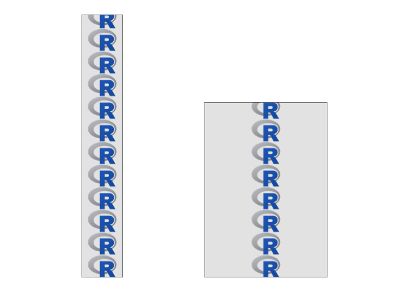
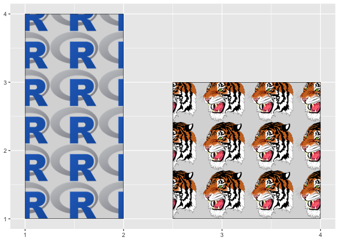
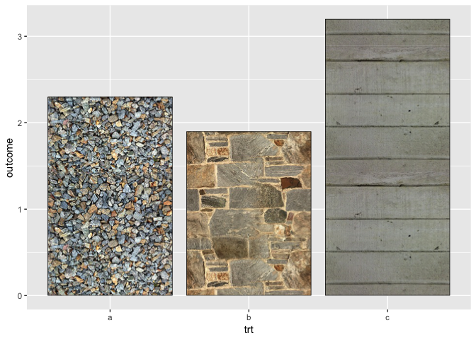
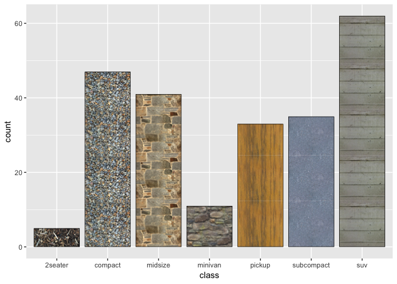
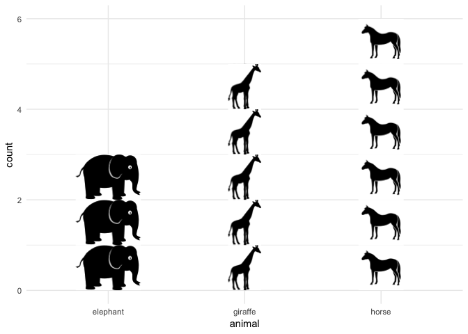
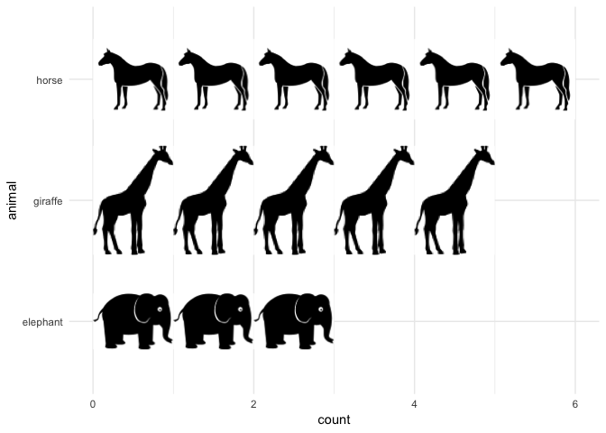

<!-- README.md is generated from README.Rmd. Please edit that file -->

# ggtextures

Written by Claus O. Wilke

This package provides functions to draw textured rectangles and bars
with the grid graphics system and with ggplot2.

**Note: The package is at the stage of tech demo/proof of concept. It is
not ready for production purposes.**

## Installation

Please install from github via:

``` r
devtools::install_github("clauswilke/ggtextures")
```

## Example

Basic example of a textured rectangle drawn with grid:

``` r
library(ggtextures)
library(grid)

img <- magick::image_read("https://jeroen.github.io/images/Rlogo.png")

grid.newpage()
tg1 <- texture_grob(
  img,
  x = unit(.2, "npc"), y = unit(.05, "npc"),
  width = unit(.1, "npc"), height = unit(.9, "npc"),
  img_width = unit(.5, "in"), ncol = 1
)
tg2 <- texture_grob(
  img,
  x = unit(.5, "npc"), y = unit(.05, "npc"),
  width = unit(.3, "npc"), height = unit(.6, "npc"),
  img_width = unit(.5, "in"), ncol = 1
)

grid.draw(tg1)
grid.draw(tg2)
```



Basic example of textured rectangles in ggplot2:

``` r
library(ggplot2)
library(tibble)

data <- tibble(
  xmin = c(1, 2.5), ymin = c(1, 1), xmax = c(2, 4), ymax = c(4, 3),
  image = list("https://jeroen.github.io/images/Rlogo.png",
               "https://jeroen.github.io/images/tiger.svg")
)

ggplot(data, aes(xmin = xmin, xmax = xmax, ymin = ymin, ymax = ymax, image = image)) +
  geom_textured_rect()
```



Textured equivalent to `geom_col()`:

``` r
df <- tibble(
  trt = c("a", "b", "c"),
  outcome = c(2.3, 1.9, 3.2),
  image = list("http://www.hypergridbusiness.com/wp-content/uploads/2012/12/rocks2-256.jpg",
               "http://www.hypergridbusiness.com/wp-content/uploads/2012/12/stone2-256.jpg",
               "http://www.hypergridbusiness.com/wp-content/uploads/2012/12/siding1-256.jpg")
  )

ggplot(df, aes(trt, outcome, image = image)) +
  geom_textured_col()
```



Textured equivalent to `geom_bar()`:

``` r
image = list(
  compact = "http://www.hypergridbusiness.com/wp-content/uploads/2012/12/rocks2-256.jpg",
  midsize = "http://www.hypergridbusiness.com/wp-content/uploads/2012/12/stone2-256.jpg",
  suv = "http://www.hypergridbusiness.com/wp-content/uploads/2012/12/siding1-256.jpg",
  `2seater` = "http://www.hypergridbusiness.com/wp-content/uploads/2012/12/mulch1-256.jpg",
  minivan = "http://www.hypergridbusiness.com/wp-content/uploads/2012/12/rocks1-256.jpg",
  pickup = "http://www.hypergridbusiness.com/wp-content/uploads/2012/12/wood3-256.jpg",
  subcompact = "http://www.hypergridbusiness.com/wp-content/uploads/2012/12/concrete1-256.jpg"
)

mpg$image <- image[mpg$class]

ggplot(mpg, aes(class, image = image)) + geom_textured_bar()
```



``` r

ggplot(mpg, aes(factor(trans), group = class, image = image)) + geom_textured_bar()
```


Isotype bars can be drawn with `geom_isotype_bar()` and
`geom_isotype_col()`. The units of the images are set as grid native
units. Default is that the image height corresponds to one data unit.

``` r
data <- tibble(
  count = c(5, 3, 6),
  animal = c("giraffe", "elephant", "horse"),
  image = list(
    "http://steveharoz.com/research/isotype/icons/giraffe.svg",
    "http://steveharoz.com/research/isotype/icons/elephant.svg",
    "http://steveharoz.com/research/isotype/icons/horse.svg"
  )
)

ggplot(data, aes(animal, count, image = image)) +
  geom_isotype_col() +
  theme_minimal()
```



``` r

ggplot(data, aes(animal, count, image = image)) +
  geom_isotype_col(
    img_width = grid::unit(1, "native"), img_height = NULL,
    ncol = NA, nrow = 1, hjust = 0, vjust = 0.5
  ) +
  coord_flip() +
  theme_minimal()
```


